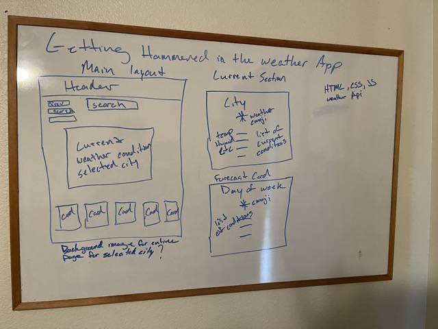

# Getting Hammered In The Weather App


## User Story

```md
For this challenge we were tasked with creating a weather forecast page for weary traveler's to plan a multi city trip
I used a combination of HTML, CSS and JavaScript to complete this challenge.
```

## Table of Contents

[Acceptance-Criteria](##Acceptance-Criteria)

[Wire-Frame](##Wire-Frame)

[URL](##URL)

[Future-Development](##Future-Development)

[License](##License)

[Languages-and-Tools](##Languages-and-Tools)

## Acceptance Criteria

```md
GIVEN a weather dashboard with form inputs

WHEN I search for a city

THEN I am presented with current and future conditions for that city and that city is added to the search history

WHEN I view current weather conditions for that city

THEN I am presented with the city name, the date, an icon representation of weather conditions, the temperature, the humidity, and the wind speed

WHEN I view future weather conditions for that city

THEN I am presented with a 5-day forecast that displays the date, an icon representation of weather conditions, the temperature, the wind speed, and the humidity

WHEN I click on a city in the search history

THEN I am again presented with current and future conditions for that city
```

## Wire Frame



## URL

https://jhammer22.github.io/my-weather-app/

## Future Development

```md
Plans for future development include saving and displaying past searched cities, adding weather icons, and more weather conditions.
```

## License 

MIT License
  
  [](https://choosealicense.com/licenses/mit-license/.)

## Languages and Tools


